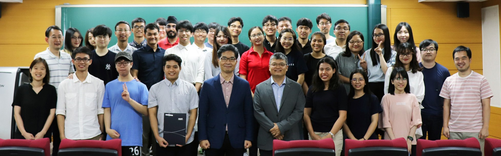
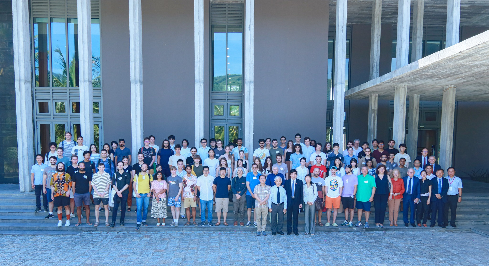

Greetings, I'm Tuyen, originally from Hai Duong City, Vietnam. It was there that I finished my high school education and pursued part of my seminary studies before following into my passion for physics. I also spent another 4 years studying economics and working for 1 year after graduating to really know how much I like science after reading the book Cosmos by Carl Sagan. The turning point came when I watched the movie titled Interstellar by C. Nolan, I was immersed in my love for the vast universe and things that humans have not yet discovered. I decided to retake the university entrance exam and study physics at VNU university of sciences. Here I completed my graduation in theoretical physics and mathematical physics with excellent degrees.

After receiving a bachelor's degree in physics. I underwent rigorous scientific training, earning my MS in 2022 from the esteemed [ Graduate University of Science and Technology](https://gust.edu.vn/vn) at the [Vietnam Academy
of Science and Technology](https://gust.edu.vn/vn).

During my university years, I had the privilege of learning under the mentorship of a physicist, [Prof. Nguyễn Xuân Hãn](https://ysip.vnu.edu.vn/cac-nha-khoa-hoc/giao-su-nguyen-xuan-han-1947-2022-nha-phan-bien-giao-duc-sac-sao-day-nghi-luc-va-tam-huyet.html) whom greatly influenced my research trajectory and sadly he passed away in 2022. 

During my master's degree years, I worked in [the Phenikaa gravitational physics group](https://sites.google.com/site/dotocxoan/phenikaa-gravitational-physics-group-pgp-group?authuser=0) under the guidance of [Dr. Tuan Q. Do](https://sites.google.com/site/dotocxoan/) who now become Associate Professor  of the PIAS Institute of Advanced Research, phenikaa University. A place that greatly influenced the direction of my cosmic inflation research.

Here are some memorable moments captured during my academic journey:

(2019 KAIX Summer Internship Program at Korea Advanced Institute of Science & Technology (KAIST), Daejeon, South Korea
Best Presenter Award at the final presentation at KAIST)

(Summer Advance School for quantum gravity in Quy Nhon, Vietnam)

  

After completing my master's program, I am in the process of looking for opportunities to study for a PhD in theoretical physics research related to cosmic inflation.

Beyond the realms of physics, I find joy in playing chess, trekking through nature's wonders, and engaging in profound conversations over a drink. My love for cinema extends to favorites such as the gripping masterpiece 'Interstellar', the thought-provoking TV series 'Mr. Robot'.